# 肿瘤数智化筛查系统 - 功能流程图文档

**文档版本**: v1.0  
**编制日期**: 2024年10月12日  
**包含内容**: 完整业务流程图、用户角色流程图、技术架构流程图

---

## 目录

1. [系统总体流程](#1-系统总体流程)
2. [普通用户流程](#2-普通用户流程)
3. [医生用户流程](#3-医生用户流程-可选)
4. [管理员流程](#4-管理员流程)
5. [核心功能详细流程](#5-核心功能详细流程)
6. [技术实现流程](#6-技术实现流程)
7. [数据流转流程](#7-数据流转流程)

---

## 1. 系统总体流程

### 1.1 系统架构流程图

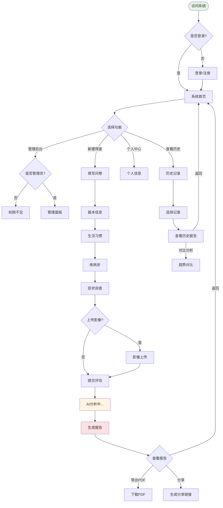

### 1.2 业务价值链流程

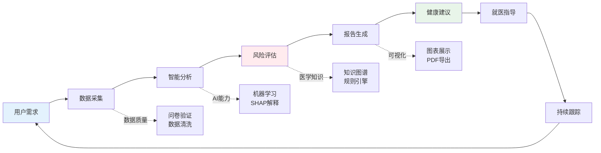

---

## 2. 普通用户流程

### 2.1 用户注册登录流程

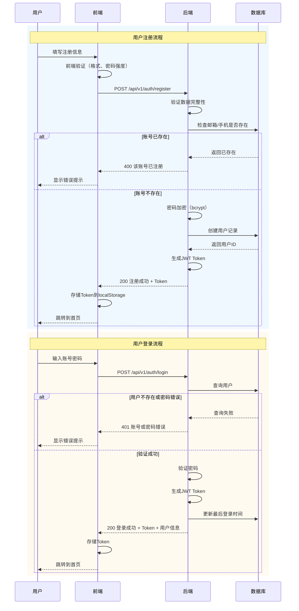

**详细说明**：

1. **注册流程**:
   - 前端验证：邮箱格式、密码长度(8-20位)、两次密码一致性
   - 后端验证：数据完整性、账号唯一性
   - 密码处理：使用bcrypt加盐哈希，不存储明文
   - Token生成：JWT包含用户ID、角色、过期时间(7天)

2. **登录流程**:
   - 安全措施：密码错误不提示具体是账号还是密码问题
   - Token管理：存储在localStorage，每次请求自动携带
   - 状态检查：验证账号是否被禁用

---

### 2.2 完整筛查流程（核心流程）

```mermaid
flowchart TD
    Start([开始筛查]) --> Check{是否登录?}
    Check -->|否| LoginPage[跳转登录页]
    Check -->|是| InitForm[初始化问卷表单]
    
    LoginPage --> Login[完成登录]
    Login --> InitForm
    
    InitForm --> CheckDraft{检测到草稿?}
    CheckDraft -->|是| ShowDraft[提示: 是否继续填写?]
    CheckDraft -->|否| Step1
    
    ShowDraft -->|是| Restore[恢复草稿数据]
    ShowDraft -->|否| Step1[第1步: 基本信息]
    Restore --> CurrentStep[跳转到上次步骤]
    
    Step1 --> Input1[填写: 年龄/性别/身高/体重]
    Input1 --> Validate1{实时验证}
    Validate1 -->|不通过| Error1[显示错误提示]
    Error1 --> Input1
    Validate1 -->|通过| CalcBMI[自动计算BMI]
    CalcBMI --> Save1[保存到localStorage]
    Save1 --> Next1{点击下一步?}
    Next1 -->|否| Wait1[等待用户操作]
    Next1 -->|是| Step2
    
    Step2[第2步: 生活习惯] --> Input2[填写: 吸烟/饮酒/运动/饮食]
    Input2 --> Conditional{吸烟史=每天吸烟?}
    Conditional -->|是| ShowSub[显示: 每日支数/烟龄输入]
    Conditional -->|否| Save2
    ShowSub --> Save2[保存到localStorage]
    Save2 --> Next2{点击下一步?}
    Next2 -->|是| Step3
    Next2 -->|否| Prev2{点击上一步?}
    Prev2 -->|是| Step1
    
    Step3[第3步: 疾病史] --> Input3[填写: 慢性病/家族史/手术史]
    Input3 --> MultiSelect[多选: 家族肿瘤类型]
    MultiSelect --> Save3[保存到localStorage]
    Save3 --> Next3{点击下一步?}
    Next3 -->|是| Step4
    Next3 -->|否| Prev3{点击上一步?}
    Prev3 -->|是| Step2
    
    Step4[第4步: 症状自查] --> Input4[多选: 近期症状]
    Input4 --> HighRisk{包含高危症状?}
    HighRisk -->|是| Warning[⚠️ 警告提示: 建议立即就医]
    HighRisk -->|否| Save4
    Warning --> Save4[保存到localStorage]
    Save4 --> Optional{是否上传影像?}
    
    Optional -->|是| Upload[跳转影像上传页]
    Optional -->|否| FinalCheck{最终确认?}
    
    Upload --> SelectFile[选择文件]
    SelectFile --> PreCheck{格式/大小检查}
    PreCheck -->|不通过| UploadError[显示错误: 文件不符合要求]
    PreCheck -->|通过| Uploading[上传中...显示进度条]
    Uploading --> UploadSuccess[上传成功]
    UploadSuccess --> Preview[显示缩略图预览]
    Preview --> FinalCheck
    
    FinalCheck -->|取消| Step4
    FinalCheck -->|确认提交| Submitting[提交中...禁用按钮]
    
    Submitting --> API1[调用API: POST /questionnaire/submit]
    API1 --> APIResp1{响应?}
    APIResp1 -->|失败| SubmitError[显示错误并允许重试]
    SubmitError --> FinalCheck
    
    APIResp1 -->|成功| GetQID[获取questionnaire_id]
    GetQID --> API2[调用API: POST /assessment/evaluate/:id]
    
    API2 --> ShowLoading[显示评估进度页面]
    ShowLoading --> Progress1[📊 正在分析您的数据...]
    Progress1 --> Progress2[🤖 AI模型计算中...]
    Progress2 --> Progress3[📈 生成个性化报告...]
    
    Progress3 --> APIResp2{响应?}
    APIResp2 -->|失败| AssessError[显示错误: 评估失败]
    AssessError --> Retry{重试?}
    Retry -->|是| API2
    Retry -->|否| End1[返回首页]
    
    APIResp2 -->|成功| GetAID[获取assessment_id]
    GetAID --> ClearDraft[清除localStorage草稿]
    ClearDraft --> JumpReport[跳转到报告页: /report/:id]
    
    JumpReport --> End([完成])
    
    style Start fill:#e1f5e1
    style Step1 fill:#e3f2fd
    style Step2 fill:#e3f2fd
    style Step3 fill:#e3f2fd
    style Step4 fill:#e3f2fd
    style Upload fill:#fff9c4
    style Submitting fill:#ffe0b2
    style ShowLoading fill:#ffe0b2
    style JumpReport fill:#c8e6c9
    style End fill:#e1f5e1
```

**关键节点说明**：

| 节点 | 说明 | 技术细节 |
|------|------|----------|
| **草稿恢复** | 防止用户刷新页面导致数据丢失 | localStorage存储，JSON格式，包含step字段 |
| **实时验证** | 每个字段blur时验证 | 前端: React Hook Form<br>后端: Flask validators |
| **条件显示** | 根据选择动态显示子问题 | 状态管理: useState/Redux |
| **BMI计算** | 身高体重变化时自动计算 | 公式: weight / (height/100)² |
| **高危警告** | 检测到特定症状立即提示 | 症状数组: ['咯血', '大便带血', '乳房肿块'] |
| **进度保存** | 每步完成后保存 | localStorage.setItem('questionnaire_draft', JSON.stringify(data)) |
| **文件上传** | 支持拖拽、预览 | react-dropzone + MinIO存储 |
| **API调用** | 两次异步调用（提交+评估） | axios + async/await |
| **加载动画** | 提升用户体验 | 3秒动画展示，实际等待后端响应 |

---

### 2.3 报告查看与导出流程

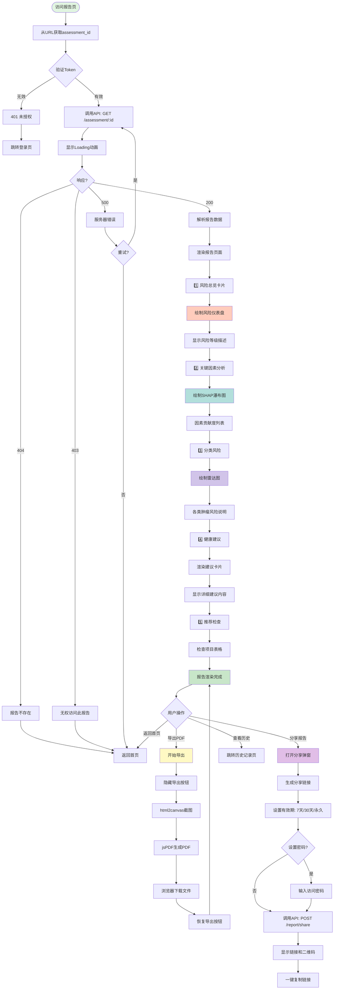

**报告页面组件说明**：

```javascript
// 报告页面数据结构
const reportData = {
  assessment_id: "uuid-xxx",
  created_at: "2024-10-12T10:30:00Z",
  
  // 1. 综合风险
  overall_risk: {
    score: 0.68,          // 0-1
    level: "高风险",       // 低/中/高/极高
    percentile: 82        // 百分位
  },
  
  // 2. 分类风险
  category_risks: {
    "肺癌": { score: 0.75, level: "高风险" },
    "胃癌": { score: 0.45, level: "中风险" },
    "肝癌": { score: 0.60, level: "高风险" },
    "结直肠癌": { score: 0.50, level: "中风险" },
    "乳腺癌": { score: 0.30, level: "低风险" }
  },
  
  // 3. 关键因素（SHAP值）
  key_factors: [
    {
      factor: "吸烟史",
      contribution: 0.35,
      direction: "increase",
      description: "长期吸烟（20年）显著增加肺癌风险"
    },
    // ...更多因素
  ],
  
  // 4. 健康建议
  recommendations: [
    {
      category: "lifestyle",
      title: "立即戒烟",
      content: "吸烟是肺癌的首要危险因素...",
      priority: 1
    },
    // ...更多建议
  ],
  
  // 5. 推荐检查
  recommended_tests: [
    {
      name: "低剂量CT",
      frequency: "每年1次",
      cost: "300-500元",
      description: "用于肺癌早期筛查"
    },
    // ...更多检查
  ]
};
```

---

### 2.4 历史记录查看流程

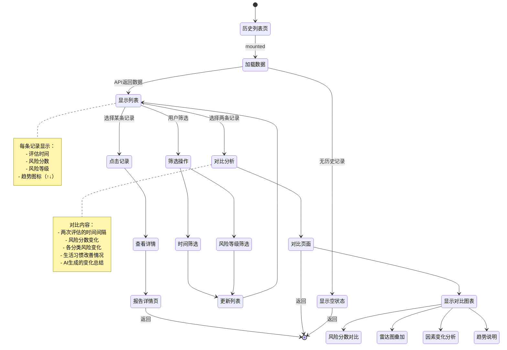

---

## 3. 医生用户流程（可选）

### 3.1 医生查看患者报告流程

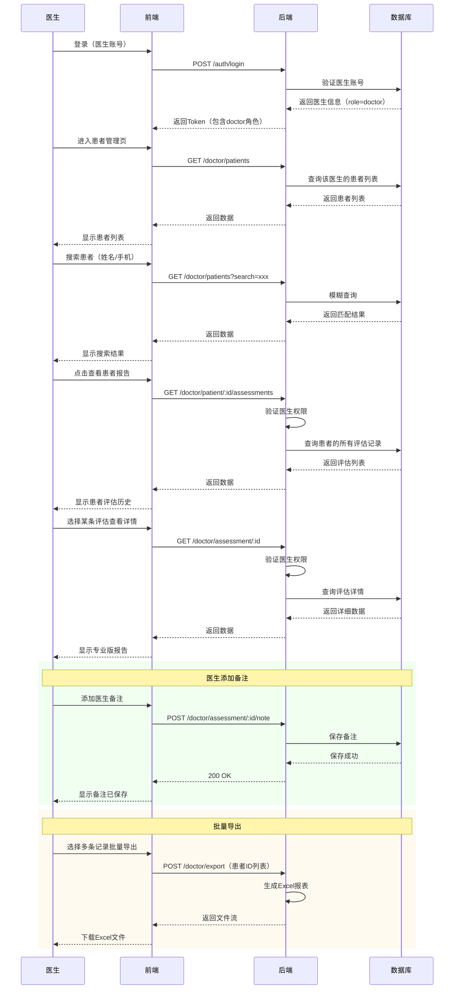

---

## 4. 管理员流程

### 4.1 管理员系统管理流程

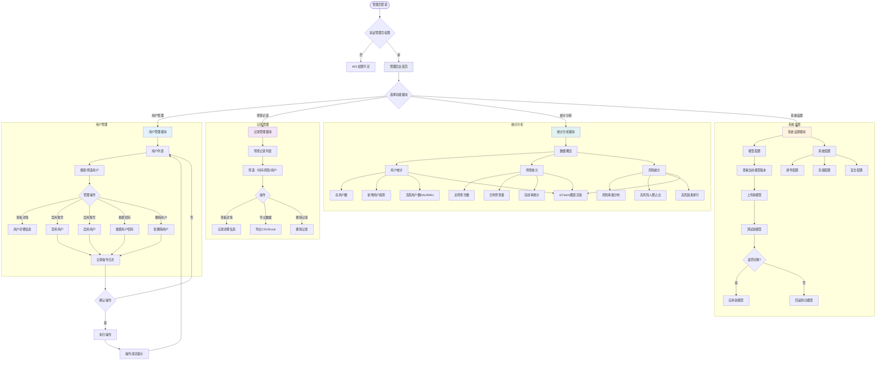

---

## 5. 核心功能详细流程

### 5.1 风险评估引擎流程

```mermaid
flowchart TB
    Start([接收问卷数据]) --> Validate[数据验证]
    Validate --> ValidCheck{验证通过?}
    ValidCheck -->|否| Error[返回错误信息]
    ValidCheck -->|是| Transform[数据转换]
    
    Transform --> Step1[1. 特征工程]
    
    subgraph 特征工程模块
        Step1 --> F1[提取基础特征]
        F1 --> F1a[年龄、性别、BMI]
        
        F1a --> F2[派生特征计算]
        F2 --> F2a[吸烟包年数 = 支数×年限/20]
        F2a --> F2b[家族史评分 = Σ亲属权重]
        F2b --> F2c[症状风险分 = 症状数×权重]
        
        F2c --> F3[交互特征生成]
        F3 --> F3a[年龄×吸烟: 老年吸烟者风险更高]
        F3a --> F3b[BMI×运动: 肥胖少动风险高]
        F3b --> F3c[家族史×症状: 双高风险人群]
        
        F3c --> F4[特征标准化]
        F4 --> F4a[加载保存的Scaler]
        F4a --> F4b[StandardScaler.transform]
    end
    
    F4b --> Step2[2. 模型推理]
    
    subgraph 模型推理模块
        Step2 --> M1[加载XGBoost模型]
        M1 --> M2[model.predict_proba]
        M2 --> M3[获取高风险概率]
        M3 --> M4[风险分级]
        M4 --> M4a{score < 0.4?}
        M4a -->|是| L1[低风险]
        M4a -->|否| M4b{score < 0.6?}
        M4b -->|是| L2[中风险]
        M4b -->|否| M4c{score < 0.8?}
        M4c -->|是| L3[高风险]
        M4c -->|否| L4[极高风险]
    end
    
    L1 --> Step3
    L2 --> Step3
    L3 --> Step3
    L4 --> Step3
    
    Step3[3. SHAP解释]
    
    subgraph SHAP解释模块
        Step3 --> S1[初始化TreeExplainer]
        S1 --> S2[计算SHAP值]
        S2 --> S3[shap_values数组]
        S3 --> S4[排序特征贡献度]
        S4 --> S5[Top 10关键因素]
        S5 --> S6[生成因素描述]
        S6 --> S6a[正向因素: 增加风险]
        S6a --> S6b[负向因素: 降低风险]
    end
    
    S6b --> Step4[4. 分类风险计算]
    
    subgraph 分类风险模块
        Step4 --> C1[肺癌风险计算]
        C1 --> C1a[考虑: 吸烟、年龄、症状]
        C1a --> C1b[权重组合得分]
        
        C1b --> C2[胃癌风险计算]
        C2 --> C2a[考虑: 饮食、家族史、慢性胃炎]
        
        C2a --> C3[肝癌风险计算]
        C3 --> C3a[考虑: 肝炎史、饮酒、家族史]
        
        C3a --> C4[结直肠癌风险]
        C4 --> C4a[考虑: 饮食、年龄、家族史]
        
        C4a --> C5[其他肿瘤风险]
        C5 --> C5a[乳腺癌、前列腺癌等]
    end
    
    C5a --> Step5[5. 建议生成]
    
    subgraph 建议生成模块
        Step5 --> R1[规则引擎匹配]
        R1 --> R1a{吸烟 AND 肺癌高风险?}
        R1a -->|是| Add1[添加: 戒烟建议]
        R1a -->|否| R1b
        
        Add1 --> R1b{BMI > 28?}
        R1b -->|是| Add2[添加: 减重建议]
        R1b -->|否| R1c
        
        Add2 --> R1c{运动不足?}
        R1c -->|是| Add3[添加: 运动建议]
        R1c -->|否| R2
        
        Add3 --> R2[筛查建议生成]
        R2 --> R2a{高风险肿瘤类型}
        R2a --> Add4[添加: 推荐检查项目]
        
        Add4 --> R3[就医建议]
        R3 --> R3a{总体风险 > 0.7?}
        R3a -->|是| Add5[添加: 立即就医建议]
        R3a -->|否| R4
        
        Add5 --> R4[AI增强可选]
        R4 --> R4a[调用大模型API]
        R4a --> R4b[生成个性化文本]
    end
    
    R4b --> Step6[6. 结果组装]
    
    Step6 --> Output[输出评估结果]
    Output --> Return{
        overall_risk,
        category_risks,
        key_factors,
        recommendations
    }
    
    Return --> SaveDB[保存到数据库]
    SaveDB --> End([返回给前端])
    
    style Start fill:#e1f5e1
    style Step1 fill:#e3f2fd
    style Step2 fill:#fff9c4
    style Step3 fill:#f3e5f5
    style Step4 fill:#e0f2f1
    style Step5 fill:#ffe0b2
    style End fill:#c8e6c9
```

**算法伪代码**：

```python
def assess_risk(user_data):
    """风险评估核心算法"""
    
    # 1. 特征工程
    features = engineer_features(user_data)
    # features = {
    #     'age': 55,
    #     'bmi': 24.5,
    #     'smoking_pack_years': 30,  # 派生特征
    #     'family_score': 2,         # 派生特征
    #     'age_x_smoking': 1650,     # 交互特征
    #     ...
    # }
    
    # 2. 标准化
    features_scaled = scaler.transform(features)
    
    # 3. 模型预测
    risk_prob = model.predict_proba(features_scaled)[0][1]
    risk_level = classify_level(risk_prob)
    
    # 4. SHAP解释
    shap_values = explainer.shap_values(features_scaled)
    key_factors = get_top_factors(shap_values, n=10)
    
    # 5. 分类风险
    category_risks = {
        '肺癌': calculate_lung_cancer_risk(user_data, features),
        '胃癌': calculate_stomach_cancer_risk(user_data, features),
        '肝癌': calculate_liver_cancer_risk(user_data, features),
        ...
    }
    
    # 6. 生成建议
    recommendations = generate_recommendations(
        risk_level, key_factors, user_data
    )
    
    return {
        'overall_risk': {'score': risk_prob, 'level': risk_level},
        'category_risks': category_risks,
        'key_factors': key_factors,
        'recommendations': recommendations
    }
```

---

### 5.2 SHAP可解释性流程

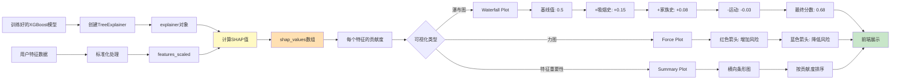

**SHAP值计算示例**：

```python
import shap
import numpy as np

# 1. 初始化解释器
explainer = shap.TreeExplainer(model)

# 2. 计算SHAP值
shap_values = explainer.shap_values(X_test)
# shap_values.shape = (n_samples, n_features)

# 3. 单个样本的SHAP值
sample_shap = shap_values[0]
# array([0.15, 0.08, -0.03, 0.05, ...])  # 每个特征的贡献

# 4. 特征重要性排序
feature_importance = pd.DataFrame({
    'feature': feature_names,
    'shap_value': sample_shap
}).sort_values('shap_value', key=abs, ascending=False)

# 输出:
#     feature         shap_value
# 0   smoking_years      0.150
# 1   family_score       0.080
# 2   age                0.050
# 3   exercise_freq     -0.030
# ...

# 5. 可视化（后端生成JSON，前端渲染）
waterfall_data = {
    'baseline': 0.5,
    'factors': [
        {'name': '吸烟史', 'value': 0.15, 'cumsum': 0.65},
        {'name': '家族史', 'value': 0.08, 'cumsum': 0.73},
        {'name': '年龄', 'value': 0.05, 'cumsum': 0.78},
        {'name': '运动', 'value': -0.03, 'cumsum': 0.75},
        ...
    ],
    'final': 0.68
}
```

---

## 6. 技术实现流程

### 6.1 前后端完整交互流程

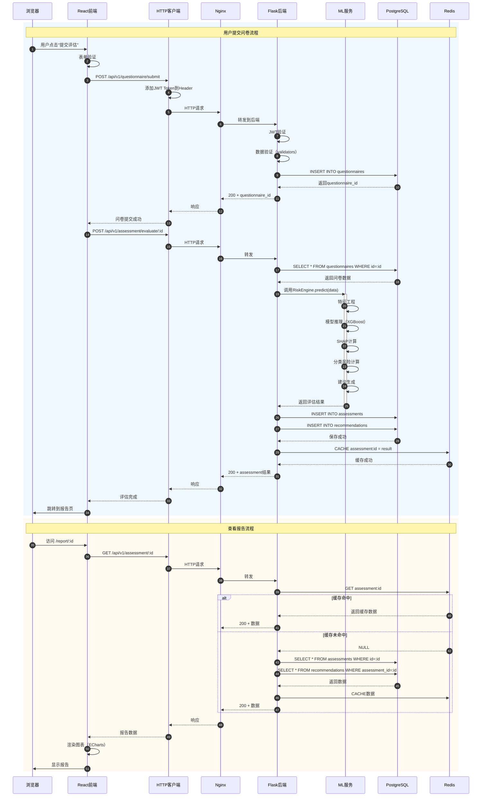

---

### 6.2 数据库事务流程

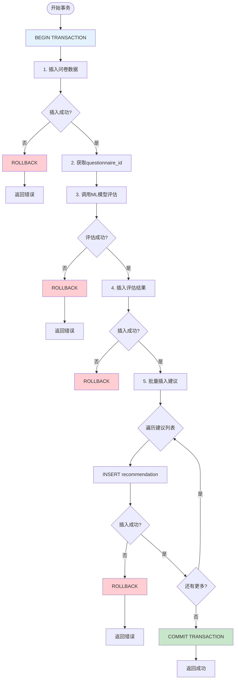

---

## 7. 数据流转流程

### 7.1 完整数据流

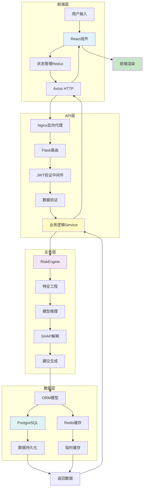

### 7.2 问卷数据转换流程

```mermaid
flowchart LR
    A[前端表单数据] -->|JSON| B[HTTP POST]
    B --> C{数据格式}
    
    C -->|原始格式| D[后端接收]
    D --> E[Python Dict]
    
    E --> F[数据验证]
    F -->|验证规则| F1[年龄: 18-120]
    F1 --> F2[身高: 100-250]
    F2 --> F3[BMI合理性]
    
    F3 --> G[数据清洗]
    G --> G1[去除空格]
    G1 --> G2[统一编码UTF-8]
    G2 --> G3[类型转换]
    
    G3 --> H[特征提取]
    H --> H1[基础特征]
    H1 --> H2[派生特征]
    H2 --> H3[交互特征]
    
    H3 --> I[DataFrame]
    I --> J[标准化]
    J --> K[NumPy数组]
    
    K --> L[模型输入]
    L --> M[XGBoost]
    M --> N[预测结果]
    
    N --> O[结果后处理]
    O --> O1[概率→分数]
    O1 --> O2[分数→等级]
    O2 --> O3[添加描述文本]
    
    O3 --> P[JSON响应]
    P --> Q[前端接收]
    Q --> R[UI渲染]
    
    style A fill:#e3f2fd
    style M fill:#fff9c4
    style P fill:#c8e6c9
    style R fill:#e1f5e1
```

**数据格式示例**：

```javascript
// 1. 前端表单数据（原始）
const formData = {
  age: "55",
  gender: "男",
  height: "175",
  weight: "70",
  smoking: "每天吸烟",
  smoking_amount: "20",
  smoking_years: "30",
  ...
};

// 2. 后端接收后处理
const cleanedData = {
  age: 55,                    // 转为整数
  gender: "男",
  height: 175.0,              // 转为浮点数
  weight: 70.0,
  bmi: 22.86,                 // 自动计算
  smoking_pack_years: 30.0,   // 派生特征
  ...
};

// 3. 特征工程后（模型输入）
const features = [
  55,        // age
  22.86,     // bmi
  30.0,      // smoking_pack_years
  2.0,       // family_score
  1650,      // age_x_smoking (交互特征)
  ...
];

// 4. 模型输出（原始）
const modelOutput = {
  predictions: [0, 1],          // 类别
  probabilities: [[0.32, 0.68]] // [低风险概率, 高风险概率]
};

// 5. 后处理结果
const finalResult = {
  overall_risk: {
    score: 0.68,
    level: "高风险",
    percentile: 82
  },
  category_risks: {...},
  key_factors: [...],
  recommendations: [...]
};

// 6. 前端渲染数据
const chartData = {
  gaugeValue: 68,           // 仪表盘
  gaugeColor: "#FA8C16",    // 橙色（高风险）
  radarData: [75, 45, 60, 50, 30], // 雷达图
  shapData: [              // 瀑布图
    {name: "吸烟史", value: 15},
    {name: "家族史", value: 8},
    ...
  ]
};
```

---

## 附录

### A. 流程图符号说明

| 符号 | 含义 | Mermaid语法 |
|------|------|-------------|
| `([])` | 开始/结束 | `Start([开始])` |
| `[]` | 处理步骤 | `Process[处理数据]` |
| `{}` | 判断条件 | `Check{条件?}` |
| `[(   )]` | 数据库 | `DB[(数据库)]` |
| `{{}}` | 输入/输出 | `IO{{输入输出}}` |
| `-->` | 流程线 | `A --> B` |
| `-.->` | 虚线 | `A -.-> B` |

### B. 颜色编码规范

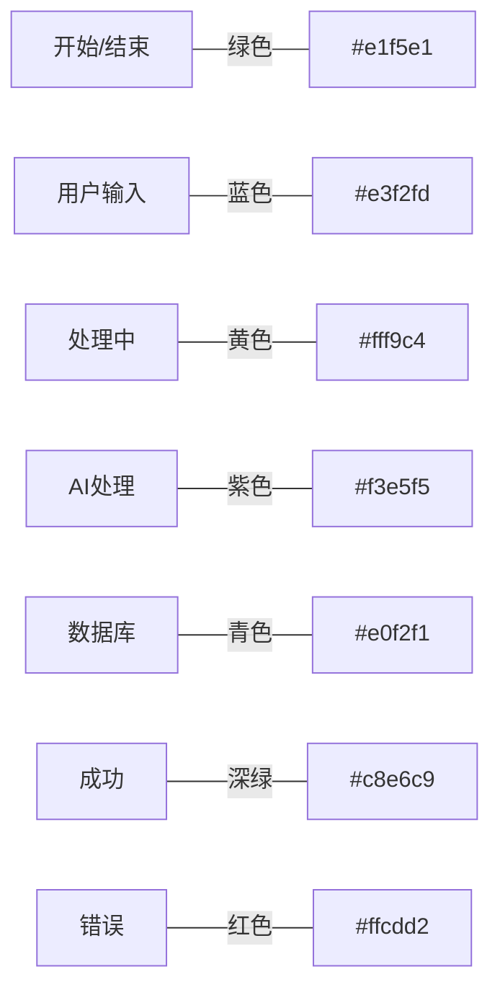

### C. 时间估算参考

| 流程 | 预计时间 | 备注 |
|------|----------|------|
| 用户注册 | 1-2分钟 | 包含验证 |
| 用户登录 | 10-30秒 | Token生成 |
| 问卷填写 | 3-5分钟 | 4步完成 |
| 风险评估 | 2-5秒 | 模型推理 |
| 报告渲染 | 1-2秒 | 图表绘制 |
| PDF导出 | 3-5秒 | html2canvas |

---

**文档结束**

*本文档提供了系统的完整流程图，涵盖用户、医生、管理员的所有操作流程。建议结合需求文档和开发文档一起阅读。*


让我为你详细梳理三种角色的权限体系：

## 🔐 系统权限体系

### 1️⃣ **普通用户（患者）权限**

#### 基础权限
```
✅ 账号管理
  - 注册新账号
  - 登录/退出
  - 修改个人信息（昵称、头像）
  - 修改密码
  - 找回密码
  - 注销账号
```

#### 核心功能权限
```
✅ 健康筛查
  - 填写健康问卷（4步问卷）
  - 保存问卷草稿
  - 上传医学影像（可选）
  - 提交筛查评估
  - 查看评估结果

✅ 报告管理
  - 查看自己的风险报告
  - 导出PDF报告
  - 分享报告（生成分享链接、设置访问密码）
  - 查看历史筛查记录
  - 对比历史记录（查看风险变化趋势）

✅ 数据访问
  - 只能访问自己的数据
  - 查看自己的筛查历史
  - 查看自己的所有报告
```

#### 限制
```
❌ 不能访问其他用户的数据
❌ 不能访问管理后台
❌ 不能查看系统统计信息
❌ 不能管理其他用户
```

---

### 2️⃣ **医生用户权限**（可选角色）

#### 继承普通用户的所有权限，额外增加：

#### 患者管理权限
```
✅ 患者信息管理
  - 查看关联患者列表
  - 搜索患者（按姓名/手机号）
  - 查看患者基本信息
  - 查看患者详细档案

✅ 报告查看权限
  - 查看患者的所有筛查记录
  - 查看患者的风险报告
  - 查看更详细的专业版报告
    * 包含原始数据
    * 模型置信度
    * 详细的SHAP值
```

#### 专业功能权限
```
✅ 医生备注
  - 在患者报告中添加医生备注
  - 编辑自己的备注
  - 查看历史备注记录

✅ 数据导出
  - 批量导出患者数据
  - 生成Excel统计报表
  - 导出患者筛查历史

✅ 专业分析
  - 查看患者风险趋势
  - 对比多个患者数据
  - 访问医学知识库
```

#### 数据访问范围
```
✅ 可以访问：
  - 自己的数据（同普通用户）
  - 关联患者的数据（需要患者授权或医患绑定）
  - 通过分享链接访问的报告

❌ 不能访问：
  - 未关联患者的数据
  - 系统管理功能
  - 其他医生的患者数据（除非共享）
```

#### 限制
```
❌ 不能修改患者的筛查数据
❌ 不能删除患者的报告
❌ 不能访问管理后台
❌ 不能管理系统配置
```

---

### 3️⃣ **管理员权限**

#### 继承普通用户的所有权限，额外增加：

#### 用户管理权限
```
✅ 用户管理
  - 查看所有用户列表
  - 搜索/筛选用户（按角色/状态/注册时间）
  - 查看用户详细信息
    * 基本信息
    * 筛查次数
    * 最后登录时间
    * 账号状态
  - 禁用/启用用户账号
  - 重置用户密码
  - 删除用户（软删除）
  - 修改用户角色（普通用户 ↔ 医生）
```

#### 数据管理权限
```
✅ 筛查记录管理
  - 查看所有筛查记录
  - 筛选记录（按时间/风险/用户）
  - 查看记录详情
  - 导出数据（CSV/Excel）
  - 删除异常记录

✅ 报告管理
  - 查看所有用户的报告
  - 批量导出报告
  - 管理分享链接
```

#### 系统统计与分析权限
```
✅ 用户统计
  - 总用户数
  - 新增用户趋势图
  - 活跃用户数（DAU/MAU）
  - 用户来源分析
  - 用户留存率

✅ 筛查统计
  - 总筛查次数
  - 日均筛查量
  - 筛查完成率
  - 各步骤流失率
  - 筛查时段分布

✅ 风险统计
  - 风险等级分布（饼图）
  - 高风险人群占比趋势
  - 各类肿瘤风险分布
  - Top10高危因素排行
  - 地域风险分布（如果采集了地区信息）

✅ 系统性能监控
  - API响应时间
  - 模型推理时间
  - 错误率统计
  - 并发用户数
  - 数据库性能
```

#### 系统配置权限
```
✅ 模型管理
  - 查看当前模型版本
  - 上传新模型文件
  - 测试新模型
  - 切换模型版本
  - 回滚到旧模型
  - 查看模型性能指标

✅ 系统设置
  - 邮件服务配置
  - 对象存储配置
  - 安全策略配置
    * JWT过期时间
    * 密码复杂度要求
    * API限流规则
  - 系统公告发布
  - 功能开关配置

✅ 日志管理
  - 查看系统日志
  - 查看操作日志
  - 查看错误日志
  - 导出日志文件
```

#### 最高权限
```
✅ 完全权限
  - 访问系统所有数据
  - 执行所有管理操作
  - 修改系统配置
  - 查看所有用户信息
  - 管理其他管理员
```

---

## 📊 权限对比表

| 功能模块         | 普通用户 | 医生            | 管理员    |
| ---------------- | -------- | --------------- | --------- |
| **账号管理**     |          |                 |           |
| 注册/登录        | ✅        | ✅               | ✅         |
| 修改个人信息     | ✅        | ✅               | ✅         |
| 注销账号         | ✅        | ✅               | ✅         |
| **健康筛查**     |          |                 |           |
| 填写问卷         | ✅        | ✅               | ✅         |
| 上传影像         | ✅        | ✅               | ✅         |
| 查看自己的报告   | ✅        | ✅               | ✅         |
| 导出PDF          | ✅        | ✅               | ✅         |
| 历史记录对比     | ✅        | ✅               | ✅         |
| **患者管理**     |          |                 |           |
| 查看患者列表     | ❌        | ✅               | ✅         |
| 查看患者报告     | ❌        | ✅（仅关联患者） | ✅（所有） |
| 添加医生备注     | ❌        | ✅               | ✅         |
| 批量导出患者数据 | ❌        | ✅               | ✅         |
| **用户管理**     |          |                 |           |
| 查看所有用户     | ❌        | ❌               | ✅         |
| 禁用/启用用户    | ❌        | ❌               | ✅         |
| 重置密码         | ❌        | ❌               | ✅         |
| 删除用户         | ❌        | ❌               | ✅         |
| 修改用户角色     | ❌        | ❌               | ✅         |
| **数据管理**     |          |                 |           |
| 查看所有记录     | ❌        | ❌               | ✅         |
| 删除记录         | ❌        | ❌               | ✅         |
| **统计分析**     |          |                 |           |
| 查看系统统计     | ❌        | ❌               | ✅         |
| 查看运营数据     | ❌        | ❌               | ✅         |
| 导出统计报表     | ❌        | ❌               | ✅         |
| **系统配置**     |          |                 |           |
| 模型管理         | ❌        | ❌               | ✅         |
| 系统设置         | ❌        | ❌               | ✅         |
| 查看日志         | ❌        | ❌               | ✅         |

---

## 🔒 权限验证机制

### 后端权限验证

```python
# backend/app/middleware/auth_middleware.py

from functools import wraps
from flask import request, jsonify
from flask_jwt_extended import verify_jwt_in_request, get_jwt_identity

def require_role(*allowed_roles):
    """角色权限装饰器"""
    def decorator(fn):
        @wraps(fn)
        def wrapper(*args, **kwargs):
            # 1. 验证JWT Token
            verify_jwt_in_request()
            
            # 2. 获取用户ID
            user_id = get_jwt_identity()
            
            # 3. 查询用户角色
            user = User.query.get(user_id)
            if not user:
                return jsonify({'error': '用户不存在'}), 404
            
            # 4. 检查账号状态
            if user.status != 'active':
                return jsonify({'error': '账号已被禁用'}), 403
            
            # 5. 检查角色权限
            if user.role not in allowed_roles:
                return jsonify({'error': '权限不足'}), 403
            
            return fn(*args, **kwargs)
        return wrapper
    return decorator


# 使用示例：

# 仅管理员可访问
@app.route('/api/v1/admin/users')
@require_role('admin')
def get_all_users():
    """获取所有用户列表"""
    pass

# 医生和管理员可访问
@app.route('/api/v1/doctor/patients')
@require_role('doctor', 'admin')
def get_patients():
    """获取患者列表"""
    pass

# 所有登录用户可访问
@app.route('/api/v1/questionnaire/submit')
@require_role('user', 'doctor', 'admin')
def submit_questionnaire():
    """提交问卷"""
    pass
```

### 前端权限验证

```javascript
// frontend/src/utils/auth.js

/**
 * 检查用户角色
 */
export const checkRole = (requiredRole) => {
  const user = JSON.parse(localStorage.getItem('user'));
  if (!user) return false;
  
  const roleHierarchy = {
    'user': 1,
    'doctor': 2,
    'admin': 3
  };
  
  return roleHierarchy[user.role] >= roleHierarchy[requiredRole];
};

/**
 * 路由守卫
 */
export const ProtectedRoute = ({ children, requireRole = 'user' }) => {
  const user = JSON.parse(localStorage.getItem('user'));
  
  if (!user) {
    return <Navigate to="/login" />;
  }
  
  if (!checkRole(requireRole)) {
    return <Navigate to="/403" />; // 权限不足页面
  }
  
  return children;
};


// 使用示例：
<Route 
  path="/admin/*" 
  element={
    <ProtectedRoute requireRole="admin">
      <AdminDashboard />
    </ProtectedRoute>
  } 
/>

<Route 
  path="/doctor/patients" 
  element={
    <ProtectedRoute requireRole="doctor">
      <PatientList />
    </ProtectedRoute>
  } 
/>
```

### 数据访问控制

```python
# 用户只能访问自己的数据
@app.route('/api/v1/assessment/<id>')
@jwt_required()
def get_assessment(id):
    user_id = get_jwt_identity()
    user = User.query.get(user_id)
    
    assessment = Assessment.query.get(id)
    if not assessment:
        return jsonify({'error': '记录不存在'}), 404
    
    # 权限检查
    if user.role == 'admin':
        # 管理员可以查看所有记录
        pass
    elif user.role == 'doctor':
        # 医生可以查看关联患者的记录
        if not is_patient_of_doctor(assessment.user_id, user_id):
            return jsonify({'error': '无权访问'}), 403
    else:
        # 普通用户只能查看自己的记录
        if assessment.user_id != user_id:
            return jsonify({'error': '无权访问'}), 403
    
    return jsonify(assessment.to_dict())
```

---

## 💡 权限设计建议

### 初期实现（必须）
1. ✅ **普通用户权限**：核心功能，必须完整实现
2. ✅ **管理员权限**：基础管理功能（用户管理、数据查看）

### 后期扩展（可选）
3. ⭐ **医生权限**：如果时间充裕可以实现
4. ⭐ **细粒度权限**：基于资源的权限控制（RBAC）

### 安全建议
- 🔐 所有API都必须验证JWT Token
- 🔐 后端必须进行权限检查，不能只依赖前端
- 🔐 敏感操作需要二次确认（如删除用户）
- 🔐 记录所有管理员操作日志
- 🔐 设置API限流防止暴力破解

---

需要我帮你：
- 📝 生成完整的权限验证代码？
- 🎨 设计权限管理界面？
- 📊 创建权限测试用例？
