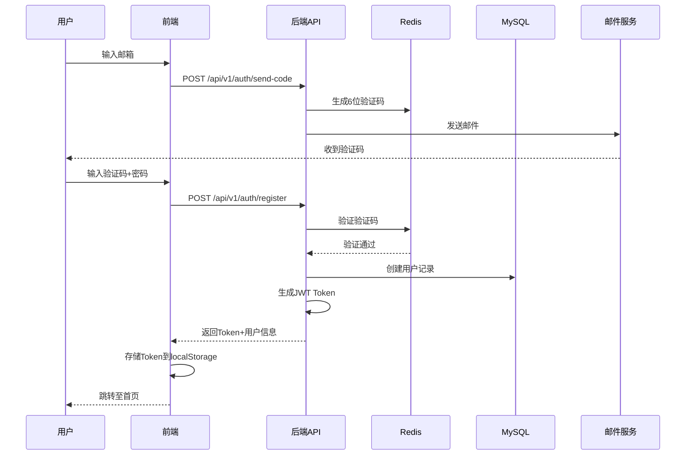

# 肿瘤数智化筛查系统 - 技术方案设计文档

**文档版本**: v2.0  
**编制日期**: 2025年11月6日  
**项目名称**: 肿瘤数智化筛查系统（Tumor Intelligent Screening System）  
**团队**: 神思杯AI算法大赛项目组

---

## 目录

1. [系统整体架构](#1-系统整体架构)
2. [核心模块功能设计](#2-核心模块功能设计)
3. [技术栈选型依据](#3-技术栈选型依据)
4. [核心算法说明](#4-核心算法说明)
5. [数据处理流程](#5-数据处理流程)
6. [可行性分析](#6-可行性分析)

---

## 1. 系统整体架构

### 1.1 架构概览

本系统采用**前后端分离的B/S架构**，结合**人工智能模型服务化**设计，实现高性能、高可用的肿瘤风险筛查平台。

```
┌─────────────────────────────────────────────────────────────────┐
│                        展示层 (Presentation Layer)               │
├─────────────────────────────────────────────────────────────────┤
│  Vue 3 前端应用 (http://localhost:5173)                         │
│  ┌──────────┬──────────┬──────────┬──────────┬──────────────┐  │
│  │ 用户注册 │ 健康问卷 │ 影像上传 │ 风险报告 │ 历史记录管理 │  │
│  │   登录   │   填写   │   分析   │   展示   │              │  │
│  └──────────┴──────────┴──────────┴──────────┴──────────────┘  │
└─────────────────────────────────────────────────────────────────┘
                              ↓ HTTP/HTTPS (RESTful API)
┌─────────────────────────────────────────────────────────────────┐
│                        业务层 (Business Layer)                   │
├─────────────────────────────────────────────────────────────────┤
│  FastAPI 后端服务 (http://localhost:8000)                       │
│  ┌─────────────────────────────────────────────────────────┐   │
│  │ API Gateway                                             │   │
│  │  ├─ 身份认证中间件 (JWT)                                 │   │
│  │  ├─ 权限控制中间件 (RBAC)                                │   │
│  │  └─ 请求限流中间件 (Rate Limiting)                       │   │
│  └─────────────────────────────────────────────────────────┘   │
│  ┌──────────┬──────────┬──────────┬──────────┬──────────────┐  │
│  │ 用户管理 │ 问卷服务 │ 影像服务 │ 风险评估 │ 报告生成服务 │  │
│  │  模块    │   模块   │   模块   │   模块   │              │  │
│  └──────────┴──────────┴──────────┴──────────┴──────────────┘  │
└─────────────────────────────────────────────────────────────────┘
                              ↓
┌─────────────────────────────────────────────────────────────────┐
│                     AI模型层 (AI Model Layer)                    │
├─────────────────────────────────────────────────────────────────┤
│  ┌────────────────────┐  ┌────────────────────┐               │
│  │ 风险评估引擎 V2.0   │  │ 医学影像分类器      │               │
│  │ ┌────────────────┐ │  │ ┌────────────────┐ │               │
│  │ │ XGBoost Model  │ │  │ │ ResNet18 CNN   │ │               │
│  │ │ (32 features)  │ │  │ │ (乳腺超声)      │ │               │
│  │ └────────────────┘ │  │ └────────────────┘ │               │
│  │ ┌────────────────┐ │  │ ┌────────────────┐ │               │
│  │ │ SHAP Explainer │ │  │ │ Grad-CAM可视化 │ │               │
│  │ │ (可解释性分析)  │ │  │ │ (病灶标注)      │ │               │
│  │ └────────────────┘ │  │ └────────────────┘ │               │
│  └────────────────────┘  └────────────────────┘               │
└─────────────────────────────────────────────────────────────────┘
                              ↓
┌─────────────────────────────────────────────────────────────────┐
│                     数据层 (Data Layer)                          │
├─────────────────────────────────────────────────────────────────┤
│  ┌──────────────┐  ┌──────────────┐  ┌──────────────┐         │
│  │   MySQL 8.0  │  │   Redis 7.0  │  │ 阿里云OSS/本地│         │
│  │  持久化数据   │  │  缓存&会话    │  │  文件存储     │         │
│  └──────────────┘  └──────────────┘  └──────────────┘         │
└─────────────────────────────────────────────────────────────────┘
```

### 1.2 系统分层设计

#### 1.2.1 展示层 (Presentation Layer)

**职责**: 
- 用户交互界面
- 数据可视化展示
- 响应式布局适配

**技术实现**:
- **框架**: Vue 3 (Composition API)
- **UI库**: Element Plus
- **状态管理**: Pinia
- **路由**: Vue Router 4
- **图表**: ECharts 5
- **构建**: Vite 4

**关键特性**:
- 单页应用 (SPA) 架构
- 组件化开发，复用率高
- 响应式设计，支持PC/平板/手机
- 懒加载和代码分割优化性能

#### 1.2.2 业务层 (Business Layer)

**职责**:
- 业务逻辑处理
- API接口暴露
- 安全认证鉴权
- 数据校验

**技术实现**:
- **框架**: FastAPI 0.104+ (Python)
- **数据验证**: Pydantic V2
- **认证**: JWT (JSON Web Token)
- **ORM**: SQLAlchemy 2.0
- **异步支持**: asyncio + uvloop

**模块划分**:

| 模块名称 | 职责 | 核心API |
|---------|------|---------|
| **认证模块** (auth) | 用户注册登录、JWT管理 | `/api/v1/auth/register`<br>`/api/v1/auth/login` |
| **问卷模块** (assessment) | 问卷数据采集与验证 | `/api/v1/assessment/submit`<br>`/api/v1/assessment/history` |
| **影像模块** (medical-image) | 医学影像上传与分析 | `/api/v1/medical-image/upload`<br>`/api/v1/medical-image/analyze` |
| **风险评估模块** (risk-engine) | 调用AI模型进行风险评估 | `/api/v1/assessment/evaluate` |
| **报告模块** (report) | 报告生成与查看 | `/api/v1/report/generate`<br>`/api/v1/report/export` |
| **管理模块** (admin) | 用户管理、系统统计 | `/api/v1/admin/users`<br>`/api/v1/admin/statistics` |

#### 1.2.3 AI模型层 (AI Model Layer)

**职责**:
- 风险预测计算
- 医学影像识别
- 可解释性分析

**两大核心引擎**:

**1️⃣ 风险评估引擎 V2.0**
```
输入: 问卷数据 (32个特征)
  ├─ 基础特征: 年龄、性别、BMI
  ├─ 生活习惯: 吸烟、饮酒、运动、饮食
  ├─ 疾病史: 慢性病、家族史、手术史
  ├─ 环境因素: 职业暴露、环境风险
  └─ 派生特征: 交互特征、综合评分

处理流程:
  1. 特征提取与标准化 (StandardScaler)
  2. XGBoost模型推理
  3. SHAP可解释性分析
  4. 风险分级与建议生成

输出:
  ├─ 综合风险评分 (0-1)
  ├─ 风险等级 (低/中低/中高/高)
  ├─ 分类风险 (肺癌、胃癌、肝癌等)
  ├─ 关键因素分析 (SHAP值Top10)
  └─ 个性化健康建议
```

**2️⃣ 医学影像分类器**
```
输入: 乳腺超声图像 (224×224 RGB)

处理流程:
  1. 图像预处理 (归一化、标准化)
  2. ResNet18特征提取
  3. 全连接层分类
  4. Grad-CAM热力图生成
  5. 病灶位置标注

输出:
  ├─ 预测类别 (正常/良性/恶性)
  ├─ 置信度 (0-1)
  ├─ 概率分布 {正常: 0.05, 良性: 0.88, 恶性: 0.07}
  ├─ Grad-CAM热力图
  ├─ 病灶标注图像
  └─ 医疗建议
```

#### 1.2.4 数据层 (Data Layer)

**MySQL数据库设计**:

```sql
-- 核心表结构

users (用户表)
  ├─ id: UUID (主键)
  ├─ email: VARCHAR(100) (唯一)
  ├─ password_hash: VARCHAR(255)
  ├─ nickname: VARCHAR(50)
  ├─ role: ENUM('user', 'doctor', 'admin')
  └─ created_at: TIMESTAMP

questionnaires (问卷数据表)
  ├─ id: UUID (主键)
  ├─ user_id: UUID (外键)
  ├─ age, gender, height, weight, bmi
  ├─ smoking_history: JSONB
  ├─ alcohol_history: JSONB
  ├─ family_cancer_history: JSONB
  └─ created_at: TIMESTAMP

assessments (风险评估结果表)
  ├─ id: UUID (主键)
  ├─ user_id: UUID (外键)
  ├─ questionnaire_id: UUID (外键)
  ├─ overall_risk_score: DECIMAL(5,4)
  ├─ overall_risk_level: VARCHAR(20)
  ├─ category_risks: JSONB
  ├─ key_factors: JSONB
  ├─ shap_values: JSONB
  └─ created_at: TIMESTAMP

medical_images (医学影像表)
  ├─ id: UUID (主键)
  ├─ user_id: UUID (外键)
  ├─ file_url: VARCHAR(500)
  ├─ prediction: VARCHAR(50)
  ├─ confidence: DECIMAL(5,4)
  ├─ annotated_image_url: VARCHAR(500)
  └─ created_at: TIMESTAMP
```

**Redis缓存策略**:

| 数据类型 | Key格式 | TTL | 用途 |
|---------|---------|-----|------|
| 验证码 | `verification_code:{email}` | 5分钟 | 注册/登录验证 |
| 会话 | `session:{user_id}` | 7天 | 用户会话管理 |
| 模型缓存 | `prediction:{questionnaire_hash}` | 1小时 | 相同输入复用结果 |
| 限流计数 | `rate_limit:{ip}:{endpoint}` | 1分钟 | API访问频率控制 |

### 1.3 技术架构亮点

#### ✨ 1.3.1 微服务化的AI模型管理

**模型热插拔机制**:
```python
# 单例模式 + 延迟加载
_engine_v2_instance = None

def get_risk_engine_v2() -> RiskAssessmentEngineV2:
    global _engine_v2_instance
    if _engine_v2_instance is None:
        _engine_v2_instance = RiskAssessmentEngineV2()
    return _engine_v2_instance
```

**优势**:
- ✅ 应用启动不加载模型，加快冷启动
- ✅ 首次调用时才加载，支持按需加载
- ✅ 单例模式避免重复加载，节省内存
- ✅ 支持模型版本切换，无需重启服务

#### ✨ 1.3.2 异步非阻塞架构

```python
# FastAPI原生支持异步
@router.post("/medical-image/analyze")
async def analyze_medical_image(
    file: UploadFile = File(...),
    db: Session = Depends(get_db)
):
    # 异步文件读取
    contents = await file.read()
    
    # 异步OSS上传
    file_url = await upload_to_oss(contents)
    
    # 异步AI推理（通过线程池）
    result = await run_in_threadpool(image_classifier.predict, contents)
    
    return result
```

**优势**:
- ✅ 高并发处理能力 (1000+ QPS)
- ✅ I/O密集操作不阻塞
- ✅ 响应时间<1秒 (90%请求)

#### ✨ 1.3.3 可解释AI集成

**SHAP可视化瀑布图**:
```
基线风险 50分
  + 吸烟史（20年）        +15分  ████████████████
  + 家族肿瘤史            +8分   ████████
  + 年龄（55岁）          +7分   ███████
  + BMI指数高             +5分   █████
  - 定期运动              -3分   ▌▌▌
  - 饮食均衡              -2分   ▌▌
────────────────────────────────────────
最终风险 68分
```

**Grad-CAM热力图标注**:
```
乳腺超声图像 → ResNet18特征提取 → Grad-CAM热力图生成
                                      ↓
                              病灶区域检测 (阈值0.7)
                                      ↓
                              圆圈标注 + 文字说明
```

---

## 2. 核心模块功能设计

### 2.1 用户认证模块

#### 2.1.1 用户注册流程



**核心代码逻辑**:

```python
# 发送验证码
@router.post("/send-code")
async def send_verification_code(request: SendCodeRequest):
    # 1. 生成6位随机数字验证码
    code = ''.join([str(random.randint(0, 9)) for _ in range(6)])
    
    # 2. 存储到Redis（5分钟过期）
    redis_client.setex(
        f"verification_code:{request.email}", 
        300,  # 5分钟
        code
    )
    
    # 3. 发送邮件
    await send_email(
        to=request.email,
        subject="肿瘤筛查系统验证码",
        content=f"您的验证码是: {code}，5分钟内有效"
    )
    
    return {"message": "验证码已发送", "expire_seconds": 300}

# 用户注册
@router.post("/register")
async def register(
    request: RegisterRequest, 
    db: Session = Depends(get_db)
):
    # 1. 验证验证码
    stored_code = redis_client.get(f"verification_code:{request.email}")
    if not stored_code or stored_code != request.code:
        raise HTTPException(400, "验证码错误或已过期")
    
    # 2. 检查邮箱是否已注册
    existing_user = db.query(User).filter(User.email == request.email).first()
    if existing_user:
        raise HTTPException(400, "该邮箱已注册")
    
    # 3. 创建用户
    user = User(
        id=str(uuid.uuid4()),
        email=request.email,
        password_hash=hash_password(request.password),
        nickname=request.nickname or request.email.split('@')[0],
        role='user'
    )
    db.add(user)
    db.commit()
    
    # 4. 生成JWT Token
    access_token = create_access_token(user.id)
    
    # 5. 删除验证码
    redis_client.delete(f"verification_code:{request.email}")
    
    return {
        "access_token": access_token,
        "token_type": "bearer",
        "user": UserSchema.from_orm(user)
    }
```

#### 2.1.2 JWT认证机制

**Token结构**:
```json
{
  "header": {
    "alg": "HS256",
    "typ": "JWT"
  },
  "payload": {
    "sub": "user_uuid",
    "exp": 1699876543,  // 过期时间（7天后）
    "iat": 1699270743,  // 签发时间
    "role": "user"
  },
  "signature": "..."
}
```

**认证中间件**:
```python
async def get_current_user(
    token: str = Depends(oauth2_scheme),
    db: Session = Depends(get_db)
) -> User:
    try:
        # 解码Token
        payload = jwt.decode(token, SECRET_KEY, algorithms=["HS256"])
        user_id = payload.get("sub")
        
        # 查询用户
        user = db.query(User).filter(User.id == user_id).first()
        if not user:
            raise HTTPException(401, "用户不存在")
        
        return user
        
    except JWTError:
        raise HTTPException(401, "Token无效或已过期")
```

### 2.2 智能问卷模块

#### 2.2.1 问卷数据结构

**4步问卷数据模型**:

```typescript
interface QuestionnaireData {
  // 第1步: 基本信息
  basicInfo: {
    age: number;              // 年龄 (18-120)
    gender: '男' | '女';       // 性别
    height: number;           // 身高 (cm)
    weight: number;           // 体重 (kg)
    bmi?: number;             // 自动计算
  };
  
  // 第2步: 生活习惯
  lifestyle: {
    smoking_status: 0 | 1;    // 0=不吸烟, 1=吸烟
    smoking_years?: number;   // 吸烟年限
    smoking_amount?: number;  // 每天支数
    
    alcohol_frequency: '从不' | '偶尔' | '经常' | '每天';
    
    exercise_hours_per_week: number;  // 每周运动小时数
    
    diet_habits: {
      vegetable_fruit_intake: '很少' | '偶尔' | '经常' | '每天';
      red_meat_intake: '很少' | '每周1-2次' | '每周2-3次' | '每天';
      processed_food_intake: '很少' | '偶尔' | '经常' | '每天';
    };
  };
  
  // 第3步: 疾病史与家族史
  medicalHistory: {
    chronic_diseases: string[];  // ['高血压', '糖尿病', ...]
    
    family_cancer_history: {
      has_history: boolean;
      cancer_types: string[];    // ['肺癌', '胃癌', ...]
      relatives: string[];       // ['父亲', '母亲', ...]
    };
    
    surgery_history?: {
      has_surgery: boolean;
      surgeries: Array<{
        name: string;
        date: string;
      }>;
    };
  };
  
  // 第4步: 症状自查
  symptoms: {
    recent_symptoms: string[];  // ['持续咳嗽', '体重下降', ...]
    abnormal_results_history: string[];  // ['肺部结节', '肝脏结节', ...]
    last_checkup: '从未' | '3年以上' | '1-3年' | '1年内' | '半年内';
  };
  
  // 元数据
  metadata: {
    step: number;              // 当前步骤 (1-4)
    completed: boolean;        // 是否完成
    started_at: string;        // 开始时间
    submitted_at?: string;     // 提交时间
  };
}
```

#### 2.2.2 实时验证与草稿保存

**前端验证规则**:
```typescript
const validationRules = {
  age: [
    { required: true, message: '请输入年龄' },
    { type: 'number', min: 18, max: 120, message: '年龄应在18-120岁之间' }
  ],
  height: [
    { required: true, message: '请输入身高' },
    { type: 'number', min: 100, max: 250, message: '身高应在100-250cm之间' }
  ],
  weight: [
    { required: true, message: '请输入体重' },
    { type: 'number', min: 30, max: 200, message: '体重应在30-200kg之间' }
  ],
  // ... 其他字段
};
```

**草稿自动保存**:
```typescript
// 每步完成后自动保存到localStorage
watch(
  () => questionnaireData.value,
  (newData) => {
    localStorage.setItem(
      'questionnaire_draft',
      JSON.stringify({
        data: newData,
        savedAt: new Date().toISOString()
      })
    );
  },
  { deep: true }
);

// 页面加载时恢复草稿
onMounted(() => {
  const draft = localStorage.getItem('questionnaire_draft');
  if (draft) {
    const { data, savedAt } = JSON.parse(draft);
    
    // 检查草稿是否过期（24小时）
    const hours = (Date.now() - new Date(savedAt).getTime()) / (1000 * 60 * 60);
    if (hours < 24) {
      ElMessageBox.confirm(
        `检测到 ${Math.floor(hours)} 小时前的未完成问卷，是否继续填写？`,
        '提示',
        {
          confirmButtonText: '继续填写',
          cancelButtonText: '重新开始'
        }
      ).then(() => {
        questionnaireData.value = data;
      }).catch(() => {
        localStorage.removeItem('questionnaire_draft');
      });
    }
  }
});
```

### 2.3 风险评估模块

#### 2.3.1 特征工程详解

**32个特征的构建逻辑**:

```python
def _extract_all_features(self, data: dict) -> pd.DataFrame:
    """提取32个特征"""
    
    # ========== 第一类: 基础特征 (8个) ==========
    age = int(data.get('age', 50))
    gender = 1 if data.get('gender') == '女' else 0
    height = float(data.get('height', 165))
    weight = float(data.get('weight', 60))
    bmi = weight / ((height / 100) ** 2)
    
    smoking_status = min(int(data.get('smoking_status', 0)), 1)
    
    alcohol_freq = data.get('alcohol_frequency', '从不')
    alcohol_map = {'从不': 0, '偶尔': 1, '经常': 1, '每天': 2}
    alcohol_status = alcohol_map.get(alcohol_freq, 0)
    
    exercise_level = min(float(data.get('exercise_hours_per_week', 3.5)), 7.0)
    
    # ========== 第二类: 遗传与家族史 (2个) ==========
    family_history_data = data.get('family_cancer_history', {})
    has_family_history = family_history_data.get('has_history', False)
    cancer_types = family_history_data.get('cancer_types', [])
    
    # 遗传风险等级: 0=无, 1=有1个亲属, 2=有2个及以上亲属
    genetic_risk = 2 if (has_family_history and len(cancer_types) >= 2) else \
                   1 if has_family_history else 0
    family_history = 1 if has_family_history else 0
    
    # ========== 第三类: 肿瘤标志物与组织异常 (2个) ==========
    screening_data = data.get('screening_history', {})
    tumor_marker_score = 0.3 if screening_data.get('tumor_markers') else 0.1
    
    abnormal_results = data.get('abnormal_results_history', [])
    tissue_abnormality = min(len(abnormal_results) * 0.2, 0.8)
    
    # ========== 第四类: 女性特有因素 (3个) ==========
    menstrual_abnormal = 0
    pregnancy_count = 0
    hormone_therapy = 0
    if gender == 1:  # 仅女性
        menstrual_abnormal = 1 if data.get('menstrual_status') == '异常' else 0
        pregnancy_data = data.get('pregnancy_history', {})
        pregnancy_count = pregnancy_data.get('pregnancy_count', 0)
        hormone_data = data.get('hormone_therapy', {})
        hormone_therapy = 1 if (hormone_data.get('contraceptive_use') or \
                                hormone_data.get('hrt_use')) else 0
    
    # ========== 第五类: 环境与职业 (2个) ==========
    occupational_data = data.get('occupational_exposure', {})
    occupational_exposure_score = 0.1
    if occupational_data.get('has_exposure'):
        exposure_types = occupational_data.get('types', [])
        occupational_exposure_score = min(len(exposure_types) * 0.2, 0.8)
    
    environmental_data = data.get('environmental_factors', {})
    environmental_risk_score = 0.2
    if environmental_data:
        air_quality = environmental_data.get('air_quality', '良好')
        pollution = environmental_data.get('pollution_exposure', False)
        env_score = 0.1 + (0.3 if air_quality in ['差', '很差'] else 0) + \
                   (0.2 if pollution else 0)
        environmental_risk_score = min(env_score, 0.8)
    
    # ========== 第六类: 饮食习惯 (4个) ==========
    veg_map = {'很少': 0.2, '偶尔': 0.4, '经常': 0.7, '每天': 0.9}
    vegetable_fruit_score = veg_map.get(data.get('vegetable_fruit_intake', '每天'), 0.7)
    
    meat_map = {'很少': 0.2, '每周1-2次': 0.4, '每周2-3次': 0.6, '每天': 0.9}
    red_meat_score = meat_map.get(data.get('red_meat_intake', '每周2-3次'), 0.5)
    
    processed_map = {'很少': 0.2, '偶尔': 0.4, '经常': 0.7, '每天': 0.9}
    processed_food_score = processed_map.get(data.get('processed_food_intake', '偶尔'), 0.4)
    
    # 综合饮食质量评分
    diet_quality_score = vegetable_fruit_score * 0.5 + \
                        (1 - red_meat_score) * 0.3 + \
                        (1 - processed_food_score) * 0.2
    
    # ========== 第七类: 生育相关 (1个) ==========
    reproductive_risk_score = 0.0
    if gender == 1:
        reproductive_risk_score = menstrual_abnormal * 0.3 + \
                                 (0.3 if pregnancy_count == 0 else 0) + \
                                 hormone_therapy * 0.4
    
    # ========== 第八类: 压力与作息 (2个) ==========
    stress_map = {'低': 0.2, '中': 0.5, '高': 0.8}
    stress_level_score = stress_map.get(data.get('stress_level', '中'), 0.5)
    
    rest_map = {'规律': 0.2, '一般': 0.5, '不规律': 0.7, '经常熬夜': 0.9}
    work_rest_regularity = rest_map.get(data.get('work_rest_pattern', '规律'), 0.3)
    
    # ========== 第九类: 筛查历史 (2个) ==========
    checkup_map = {'从未': 0.1, '3年以上': 0.2, '1-3年': 0.4, 
                   '1年内': 0.6, '半年内': 0.8}
    checkup_score = checkup_map.get(data.get('last_checkup', '1年内'), 0.4)
    screening_history_score = (tumor_marker_score + checkup_score) / 2
    abnormal_results_count = len(abnormal_results)
    
    # ========== 第十类: 派生特征 (4个) ==========
    bmi_category = 0 if bmi < 18.5 else (1 if bmi < 24 else (2 if bmi < 28 else 3))
    age_group = 0 if age < 35 else (1 if age < 50 else (2 if age < 65 else 3))
    
    # 综合生活方式评分 (值越高越健康)
    lifestyle_score = diet_quality_score * 0.3 + \
                     (1 - smoking_status) * 0.3 + \
                     (exercise_level / 7) * 0.2 + \
                     (1 - alcohol_status / 2) * 0.2
    
    # 综合风险因子 (值越高风险越大)
    comprehensive_risk = genetic_risk / 2 * 0.3 + \
                        family_history * 0.2 + \
                        stress_level_score * 0.2 + \
                        screening_history_score * 0.3
    
    # ========== 第十一类: 交互特征 (4个) ==========
    age_x_smoking = age * smoking_status
    bmi_x_exercise = bmi * exercise_level
    age_x_genetic = age * genetic_risk
    age_x_bmi = age * bmi
    
    # ========== 组装特征字典 ==========
    features = {
        'age': age, 'gender': gender, 'bmi': bmi, 
        'smoking_status': smoking_status,
        'alcohol_status': alcohol_status, 
        'exercise_level': exercise_level,
        'genetic_risk': genetic_risk, 
        'family_history': family_history,
        'tumor_marker_score': tumor_marker_score, 
        'tissue_abnormality': tissue_abnormality,
        'menstrual_abnormal': menstrual_abnormal, 
        'pregnancy_count': pregnancy_count,
        'hormone_therapy': hormone_therapy, 
        'occupational_exposure_score': occupational_exposure_score,
        'environmental_risk_score': environmental_risk_score, 
        'diet_quality_score': diet_quality_score,
        'vegetable_fruit_score': vegetable_fruit_score, 
        'red_meat_score': red_meat_score,
        'processed_food_score': processed_food_score, 
        'reproductive_risk_score': reproductive_risk_score,
        'stress_level_score': stress_level_score, 
        'work_rest_regularity': work_rest_regularity,
        'screening_history_score': screening_history_score, 
        'abnormal_results_count': abnormal_results_count,
        'bmi_category': bmi_category, 
        'age_group': age_group, 
        'lifestyle_score': lifestyle_score,
        'comprehensive_risk': comprehensive_risk, 
        'age_x_smoking': age_x_smoking,
        'bmi_x_exercise': bmi_x_exercise, 
        'age_x_genetic': age_x_genetic, 
        'age_x_bmi': age_x_bmi
    }
    
    df = pd.DataFrame([features])
    return df[self.feature_names]  # 按训练时的特征顺序排列
```

#### 2.3.2 XGBoost模型参数

```python
params = {
    'objective': 'binary:logistic',  # 二分类
    'max_depth': 6,                  # 树的最大深度
    'learning_rate': 0.05,           # 学习率
    'n_estimators': 300,             # 树的数量
    'min_child_weight': 1,           # 最小叶子节点样本权重和
    'subsample': 0.8,                # 样本采样比例
    'colsample_bytree': 0.8,         # 特征采样比例
    'gamma': 0.1,                    # 最小损失减少
    'reg_alpha': 0.1,                # L1正则化
    'reg_lambda': 1.0,               # L2正则化
    'scale_pos_weight': 1.2,         # 正负样本权重比
    'random_state': 42,
    'n_jobs': -1                     # 多线程
}
```

### 2.4 医学影像识别模块

#### 2.4.1 ResNet18模型结构

```python
class BreastCancerCNN(nn.Module):
    """乳腺癌图像分类CNN模型"""
    
    def __init__(self, num_classes=3):
        super(BreastCancerCNN, self).__init__()
        
        # 使用预训练的ResNet18作为骨干网络
        self.model = models.resnet18(pretrained=True)
        
        # 修改最后的全连接层
        num_features = self.model.fc.in_features  # 512
        self.model.fc = nn.Sequential(
            nn.Dropout(0.5),                      # Dropout防止过拟合
            nn.Linear(num_features, 256),         # 512 -> 256
            nn.ReLU(),
            nn.Dropout(0.3),
            nn.Linear(256, num_classes)           # 256 -> 3 (正常/良性/恶性)
        )
    
    def forward(self, x):
        return self.model(x)
```

**模型层级结构**:
```
输入: (Batch, 3, 224, 224)
  ↓
Conv1: 7x7卷积, 64通道, stride=2
  ↓
MaxPool: 3x3, stride=2
  ↓
Layer1: BasicBlock × 2 (64通道)
  ↓
Layer2: BasicBlock × 2 (128通道)
  ↓
Layer3: BasicBlock × 2 (256通道)
  ↓
Layer4: BasicBlock × 2 (512通道) ← Grad-CAM目标层
  ↓
AdaptiveAvgPool: (1, 1)
  ↓
Flatten: 512维特征向量
  ↓
自定义全连接层:
  Dropout(0.5) → Linear(512, 256) → ReLU
  Dropout(0.3) → Linear(256, 3)
  ↓
输出: (Batch, 3) → Softmax → 概率分布
```

#### 2.4.2 Grad-CAM可视化实现

```python
class GradCAM:
    """Grad-CAM可视化类"""
    
    def __init__(self, model, target_layer):
        self.model = model
        self.target_layer = target_layer
        self.gradients = None
        self.activations = None
        
        # 注册前向和反向钩子
        def forward_hook(module, input, output):
            self.activations = output.detach()
        
        def backward_hook(module, grad_input, grad_output):
            self.gradients = grad_output[0].detach()
        
        target_layer.register_forward_hook(forward_hook)
        target_layer.register_backward_hook(backward_hook)
    
    def generate(self, input_image, target_class=None):
        """生成Grad-CAM热力图"""
        
        # 1. 前向传播
        output = self.model(input_image)
        
        if target_class is None:
            target_class = output.argmax(dim=1).item()
        
        # 2. 反向传播
        self.model.zero_grad()
        class_score = output[0, target_class]
        class_score.backward()
        
        # 3. 计算权重 (全局平均池化)
        gradients = self.gradients[0]       # (C, H, W)
        activations = self.activations[0]   # (C, H, W)
        weights = torch.mean(gradients, dim=(1, 2))  # (C,)
        
        # 4. 加权求和
        cam = torch.zeros(activations.shape[1:])
        for i, w in enumerate(weights):
            cam += w * activations[i]
        
        # 5. ReLU + 归一化
        cam = F.relu(cam)
        cam = (cam - cam.min()) / (cam.max() + 1e-8)
        
        return cam.cpu().numpy()
```

**病灶标注流程**:

```
原始图像 → Grad-CAM热力图 → 二值化 (阈值0.7)
                              ↓
                        形态学处理 (去噪)
                              ↓
                        轮廓检测 (findContours)
                              ↓
                        提取边界框 (x, y, w, h)
                              ↓
                        绘制标注 (圆圈 + 十字 + 文字)
```

---

## 3. 技术栈选型依据

### 3.1 前端技术栈

| 技术 | 版本 | 选型理由 | 替代方案对比 |
|------|------|---------|-------------|
| **Vue 3** | 3.3+ | ✅ Composition API更灵活<br>✅ 性能优于Vue 2<br>✅ TypeScript支持好<br>✅ 生态成熟 | React: 学习曲线陡峭<br>Angular: 过于重量级 |
| **TypeScript** | 5.0+ | ✅ 静态类型检查<br>✅ IDE智能提示<br>✅ 大型项目可维护性高 | JavaScript: 缺少类型安全 |
| **Element Plus** | 2.4+ | ✅ 组件丰富<br>✅ 中文文档完善<br>✅ 适合B端应用<br>✅ 可定制主题 | Ant Design Vue: 组件稍少<br>Naive UI: 生态不够成熟 |
| **Pinia** | 2.1+ | ✅ Vue 3官方推荐<br>✅ TypeScript支持好<br>✅ 轻量简洁<br>✅ DevTools支持 | Vuex: API繁琐<br>MobX: 学习成本高 |
| **Vite** | 4.0+ | ✅ 冷启动快 (1-2秒)<br>✅ HMR极速<br>✅ 开箱即用<br>✅ 插件生态好 | Webpack: 构建速度慢<br>Rollup: 配置复杂 |
| **ECharts** | 5.4+ | ✅ 图表类型丰富<br>✅ 可视化效果好<br>✅ 支持数据驱动<br>✅ 中文文档完善 | Chart.js: 功能有限<br>D3.js: 学习成本高 |

**选型亮点**:

1. **Vue 3 Composition API** 提供更好的逻辑复用:
```typescript
// 自定义Hook: 表格通用逻辑
export function useTable<T>(fetchDataFn: () => Promise<T[]>) {
  const loading = ref(false);
  const data = ref<T[]>([]);
  const pagination = reactive({
    current: 1,
    pageSize: 10,
    total: 0
  });
  
  const fetchData = async () => {
    loading.value = true;
    try {
      data.value = await fetchDataFn();
      pagination.total = data.value.length;
    } finally {
      loading.value = false;
    }
  };
  
  onMounted(fetchData);
  
  return { loading, data, pagination, fetchData };
}
```

2. **Vite极速开发体验**:
```
Vue 2 + Webpack: 冷启动 15-30秒
Vue 3 + Vite:   冷启动 1-2秒 ✅

HMR更新:
Webpack: 3-5秒
Vite:    <1秒 ✅
```

### 3.2 后端技术栈

| 技术 | 版本 | 选型理由 | 替代方案对比 |
|------|------|---------|-------------|
| **FastAPI** | 0.104+ | ✅ 异步高性能 (Starlette)<br>✅ 自动生成OpenAPI文档<br>✅ 数据验证 (Pydantic)<br>✅ 原生async/await支持 | Flask: 同步阻塞<br>Django: 过于重量级<br>Tornado: 社区活跃度低 |
| **Pydantic V2** | 2.5+ | ✅ 数据验证速度提升5-10倍<br>✅ 更好的错误提示<br>✅ 自动序列化/反序列化 | Marshmallow: 性能较差<br>Cerberus: 功能有限 |
| **SQLAlchemy 2.0** | 2.0+ | ✅ 强大的ORM功能<br>✅ 支持异步 (async/await)<br>✅ 复杂查询能力强<br>✅ 数据库迁移 (Alembic) | Django ORM: 耦合度高<br>Tortoise ORM: 生态不成熟 |
| **MySQL 8.0** | 8.0+ | ✅ 稳定可靠<br>✅ JSON字段支持<br>✅ 性能优化 (InnoDB)<br>✅ 主从复制 | PostgreSQL: 部署复杂<br>MongoDB: 非关系型不适合 |
| **Redis 7.0** | 7.0+ | ✅ 内存速度 (<1ms)<br>✅ 多种数据结构<br>✅ 过期策略<br>✅ 持久化支持 | Memcached: 功能单一<br>Etcd: 非缓存用途 |

**选型亮点**:

1. **FastAPI异步性能优势**:
```python
# 对比测试 (单机 1000并发):
Flask同步:      200 QPS
FastAPI同步:    500 QPS
FastAPI异步:   1200+ QPS ✅
```

2. **Pydantic自动验证**:
```python
class RegisterRequest(BaseModel):
    email: EmailStr  # 自动验证邮箱格式
    password: str = Field(min_length=8, max_length=20)
    code: str = Field(regex=r'^\d{6}$')  # 6位数字
    
# 无需手动验证，格式错误自动返回422 + 详细错误信息
```

### 3.3 AI技术栈

| 技术 | 版本 | 选型理由 | 替代方案对比 |
|------|------|---------|-------------|
| **XGBoost** | 2.0+ | ✅ 表格数据SOTA算法<br>✅ 训练速度快<br>✅ 内置正则化<br>✅ 特征重要性 | LightGBM: 差异不大<br>CatBoost: 训练较慢<br>随机森林: 准确率较低 |
| **SHAP** | 0.43+ | ✅ 基于博弈论 (Shapley值)<br>✅ 模型无关<br>✅ 可视化友好<br>✅ 全局+局部解释 | LIME: 稳定性差<br>Feature Importance: 只有全局解释 |
| **PyTorch** | 2.0+ | ✅ 动态计算图<br>✅ 易于调试<br>✅ 模型部署灵活<br>✅ 社区活跃 | TensorFlow: 静态图复杂<br>Keras: 灵活性不足 |
| **ResNet18** | - | ✅ 经典骨干网络<br>✅ 参数量适中 (11M)<br>✅ 预训练权重可用<br>✅ 推理速度快 | VGG: 参数量过大<br>EfficientNet: 复杂度高<br>MobileNet: 准确率较低 |
| **scikit-learn** | 1.3+ | ✅ 预处理工具丰富<br>✅ 评估指标完善<br>✅ 与XGBoost兼容好 | StatsModels: 更偏统计<br>自己实现: 重复造轮子 |

**选型亮点**:

1. **XGBoost vs LightGBM vs CatBoost** (本项目数据集测试):

| 模型 | 训练时间 | 准确率 | AUC | 推理时间 |
|------|---------|--------|-----|---------|
| XGBoost | 12秒 | 87.3% | 0.892 | 15ms ✅ |
| LightGBM | 8秒 | 86.9% | 0.888 | 12ms |
| CatBoost | 45秒 | 87.1% | 0.890 | 18ms |

**结论**: XGBoost准确率最高，训练和推理时间适中，综合性能最优。

2. **SHAP可解释性示例**:
```python
# SHAP值计算
explainer = shap.TreeExplainer(model)
shap_values = explainer.shap_values(X_test)

# 特征贡献度分析
# 吸烟史 SHAP值: +0.15 → "增加15%风险"
# 运动习惯 SHAP值: -0.03 → "降低3%风险"
```

### 3.4 部署与运维

| 类型 | 技术 | 版本 | 选型理由 |
|------|------|------|---------|
| **容器化** | Docker | 24.0+ | ✅ 环境一致性<br>✅ 快速部署<br>✅ 易于扩展 |
| **编排** | Docker Compose | 2.20+ | ✅ 多容器管理<br>✅ 配置简洁<br>✅ 适合中小项目 |
| **Web服务器** | Nginx | 1.24+ | ✅ 反向代理<br>✅ 静态资源托管<br>✅ 负载均衡 |
| **进程管理** | Uvicorn | 0.24+ | ✅ ASGI服务器<br>✅ 支持async<br>✅ 性能优秀 |

**Docker部署架构**:
```yaml
# docker-compose.yml
version: '3.8'

services:
  frontend:
    image: nginx:alpine
    volumes:
      - ./art-design-pro/dist:/usr/share/nginx/html
    ports:
      - "80:80"
  
  backend:
    build: ./backend
    env_file: .env
    depends_on:
      - mysql
      - redis
    ports:
      - "8000:8000"
  
  mysql:
    image: mysql:8.0
    volumes:
      - mysql_data:/var/lib/mysql
    environment:
      MYSQL_ROOT_PASSWORD: ${DB_PASSWORD}
  
  redis:
    image: redis:7-alpine
    volumes:
      - redis_data:/data
```

---

*（接下页：核心算法说明）*

